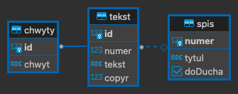

## Serverless 3 - AWS Node.js Express JS

### General Information
- This project provides a REST API for the KoinoniaSongs app.
- The API is built using the Serverless framework and AWS Lambda.
- The API is written in Node.js and Express.js.
- The API is deployed to AWS Lambda and AWS API Gateway.


### Setup
You have to install globally Serverless framework, AWS CLI, Node JS.
Configure AWS CLI with your credentials.
You need to have database with this structure:


Then ```npm install``` in root directory.


### Deploying

```
serverless deploy --stage dev --aws-profile [name_of_profile]
```